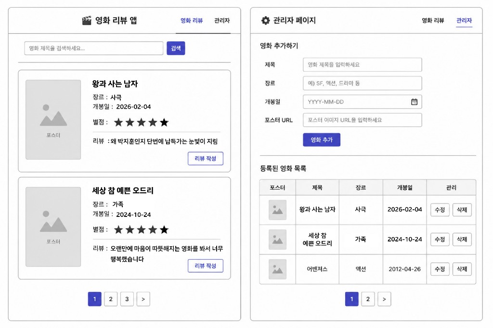

# PRD — 영화 리뷰 화면

> 관련 문서: [프로젝트 PRD](./PRD.md) · [관리자 화면 PRD](./PRD-관리자-화면.md)

## 1. 화면 개요

### 1.1 화면명

영화 리뷰 (메인 화면)

### 1.2 목적

등록된 영화 목록을 검색·열람하고, 각 영화의 평균 별점·리뷰 요약을 확인한 뒤 리뷰를 작성할 수 있는 사용자용 화면이다.

### 1.3 접근 경로

- 앱 진입 시 기본 화면
- 공통 헤더의 **영화 리뷰** 네비게이션 선택 시

### 1.4 와이어프레임

*(와이어프레임 이미지: 좌측 「영화 리뷰」 화면)*

---

## 2. 레이아웃 구조

화면은 상단에서 하단 순으로 다음 영역으로 구성한다.

| 영역 | 설명 |
|------|------|
| 헤더 | 앱 타이틀, 아이콘, 글로벌 네비게이션 |
| 검색 | 영화 제목 검색 입력 + 검색 버튼 |
| 영화 목록 | 카드 형태의 영화·리뷰 요약 목록 |
| 페이지네이션 | 목록 페이지 이동 |

전체 콘텐츠는 중앙 정렬된 단일 컬럼 레이아웃을 사용한다.

---

## 3. UI 구성 요소

### 3.1 헤더

| 요소 | 요구 사항 |
|------|-----------|
| 아이콘 | 영화 슬레이트(클래퍼) 형태의 앱 아이콘 |
| 타이틀 | **영화 리뷰 앱** 텍스트 표시 |
| 네비게이션 | **영화 리뷰**, **관리자** 두 링크를 우측에 배치 |
| 활성 상태 | 현재 화면인 **영화 리뷰**에 밑줄(또는 동등한 활성 스타일) 표시 |

**동작**

- **관리자** 클릭 시 관리자 화면으로 이동한다.
- **영화 리뷰** 클릭 시 동일 화면이면 유지, 다른 화면에서 진입 시 본 화면으로 이동한다.

### 3.2 검색 영역

| 요소 | 요구 사항 |
|------|-----------|
| 검색 입력 | placeholder: `영화 제목을 검색하세요...` |
| 검색 버튼 | 라벨 **검색**, 주요 액션 색(파란색) |

**동작**

- 사용자가 제목 키워드를 입력한 뒤 **검색** 클릭 또는 Enter 입력 시 목록을 필터링한다.
- 검색어가 비어 있을 때 **검색** 실행 시 전체 목록을 표시한다(또는 안내 메시지 — 구현 시 하나로 통일).
- 검색 결과가 없으면 「검색 결과가 없습니다」 등 빈 상태 메시지를 목록 영역에 표시한다.

### 3.3 영화 카드 (목록 항목)

각 영화는 가로형 카드 1개로 표시한다.

| 영역 | 요소 | 요구 사항 |
|------|------|-----------|
| 좌측 | 포스터 | 정사각형 썸네일. `poster_url`이 있으면 이미지 표시, 없으면 기본 플레이스홀더 |
| 우측 상단 | 제목 | 영화 제목, 굵은 글씨 |
| 우측 | 장르 | 라벨 **장르** + 값 (예: 드라마, SF) |
| 우측 | 개봉일 | 라벨 **개봉일** + `YYYY-MM-DD` 형식 |
| 우측 | 별점 | 5점 만점 별 아이콘. 해당 영화의 **평균 별점**을 시각화 (소수 반올림 규칙은 구현 시 정의) |
| 우측 | 리뷰 요약 | 라벨 **리뷰 :** + 대표 리뷰 텍스트 일부(말줄임 처리 가능) |
| 우측 하단 | 리뷰 작성 버튼 | 라벨 **리뷰 작성**, 카드 우측 하단 정렬 |

**데이터 표시 규칙**

- 리뷰가 없는 영화: 별점 0 또는 빈 별, 리뷰 영역에 「아직 리뷰가 없습니다」 등 표시.
- 리뷰가 여러 개인 경우: 최신 리뷰 1건을 요약으로 표시하거나, 평균 별점만 강조하고 리뷰 문구는 최신 1건 — 구현 전 Product에서 확정(기본: 최신 리뷰 1건 요약).

**동작**

- **리뷰 작성** 클릭 시 해당 영화에 대한 리뷰 작성 UI로 전환한다.  
  - MVP: 모달 또는 인라인 폼(별점 1~5, 리뷰 본문, 등록/취소).  
  - 등록 성공 시 카드의 별점·리뷰 요약을 갱신한다.

### 3.4 페이지네이션

| 요소 | 요구 사항 |
|------|-----------|
| 위치 | 목록 하단 중앙 |
| 구성 | 페이지 번호 버튼(예: 1, 2, 3) + 다음 페이지 `>` 버튼 |
| 활성 페이지 | 현재 페이지 번호에 강조 배경(파란색) |
| 비활성 | 첫 페이지에서 이전 버튼 없음, 마지막 페이지에서 `>` 비활성 또는 숨김 |

**동작**

- 페이지당 표시 개수는 구현 상수로 정의(예: 10개). 목록·검색 결과에 동일하게 적용한다.
- 페이지 변경 시 목록 영역만 갱신하고 스크롤은 목록 상단으로 이동(권장).

---

## 4. 사용자 시나리오

| # | 시나리오 | 기대 결과 |
|---|----------|-----------|
| 1 | 앱 접속 | 영화 리뷰 화면이 기본으로 열리고, 등록 영화 카드 목록이 보인다 |
| 2 | 제목 검색 | 입력한 키워드에 맞는 영화만 카드로 표시된다 |
| 3 | 페이지 이동 | 다음/특정 페이지의 영화 카드가 표시된다 |
| 4 | 리뷰 작성 | 별점·본문 입력 후 저장되면 카드에 반영된다 |
| 5 | 관리자 이동 | 헤더 **관리자**로 관리자 화면 전환 |

---

## 5. 데이터·API 연동 (참고)

화면에 필요한 영화 필드(관리자 화면에서 등록):

| 필드 | 용도 |
|------|------|
| `title` | 제목, 검색 |
| `genre` | 장르 표시 |
| `release_date` | 개봉일 표시 |
| `poster_url` | 포스터 썸네일 |

리뷰 관련:

| 필드 | 용도 |
|------|------|
| `rating` (1~5) | 평균 별점 계산 |
| `content` | 카드 리뷰 요약 |

---

## 6. 비기능·UI 가이드

- **디자인**: 프로젝트 PRD의 「간단한 디자인」 준수 — 흰/회색 배경, 파란색 주요 버튼·활성 상태
- **반응형**: 모바일에서 검색·카드·버튼이 세로로 자연스럽게 줄 바꿈
- **접근성**: 검색 입력·버튼에 적절한 `label`/`aria-label`, 별점은 시각 외 텍스트 보조(예: 「평균 4점」)

---

## 7. 범위 외 (본 화면)

- 영화 등록·수정·삭제 → **관리자** 화면
- 로그인·회원 기능
- 리뷰 수정·삭제 UI → 본 화면 MVP에서는 「리뷰 작성」만 와이어프레임에 명시; 수정·삭제는 추후 카드/상세 확장 시 별도 PRD 보완 가능

---

## 8. 수용 기준 (Acceptance Criteria)

- [ ] 헤더에 타이틀·아이콘·**영화 리뷰** / **관리자** 네비가 있고, 현재 화면이 시각적으로 구분된다
- [ ] 검색창 placeholder와 **검색** 버튼으로 제목 검색이 동작한다
- [ ] 각 카드에 포스터, 제목, 장르, 개봉일, 별점, 리뷰 요약, **리뷰 작성** 버튼이 표시된다
- [ ] **리뷰 작성**으로 별점·리뷰를 등록할 수 있고 목록에 반영된다
- [ ] 영화가 많을 때 페이지네이션으로 페이지 이동이 가능하다
- [ ] **관리자** 링크로 관리자 화면으로 이동한다
